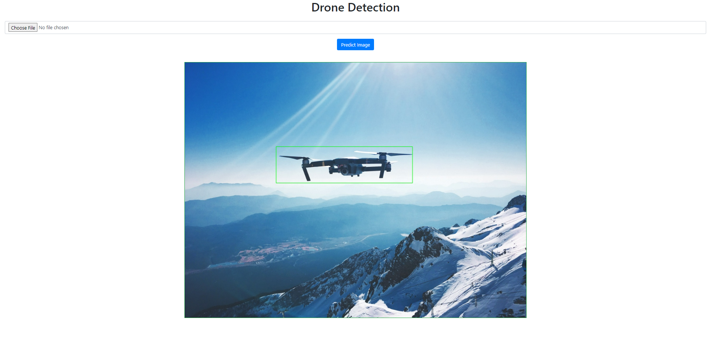

# Drone Detection
A web app that can detect drones from any given image.
 
## Dataset
To train the machine learning model to detect drones, I have used a [dataset](https://www.kaggle.com/datasets/dasmehdixtr/drone-dataset-uav) from the Kaggle platform.

## Main Tools Used
- **Flask** - framework used to create the web app and to intergrate the machine learning model
- **YOLOv5** - YOLOv5 is a state of the art object detection machine learning model. I trained this model on drone data to specifically detect drones. More details on training this model can be viewed in this file: [DroneDetectionTrain.ipynb](MachineLearning/DroneDetectionTrain.ipynb)

## How This Works


## How To Use
1. First download the repository
2. Then install requirements.txt to download all the required modules to run this program
```
pip install -r requirements.txt
```
3. Run `app.py`
4. Go to: http://127.0.0.1:5000/

